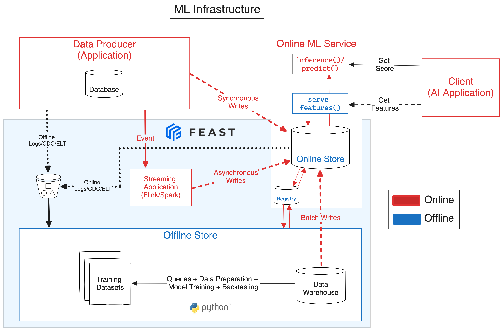

# Feature Serving and Model Inference





**Note:** this ML Infrastructure diagram highlights an orchestration pattern that is driven by a client application. 
This is not the only approach that can be taken and different patterns will result in different trade-offs.


Production machine learning systems can choose from four approaches to serving machine learning predictions (the output 
of model inference):
1. Online model inference with online features
2. Offline mode inference without online features
3. Online model inference with online features and cached predictions
4. Online model inference without features 

*Note: online features can be sourced from batch, streaming, or request data sources.*

These three approaches have different tradeoffs but, in general, have significant implementation differences. 

## 1. Online Model Inference with Online Features
Online model inference with online features is a powerful approach to serving data-driven machine learning applications.
This requires a feature store to serve online features and a model server to serve model predictions (e.g., KServe).
This approach is particularly useful for applications where request-time data is required to run inference.
```python
features = store.get_online_features(
    feature_refs=[
        "user_data:click_through_rate",
        "user_data:number_of_clicks",
        "user_data:average_page_duration",
    ],
    entity_rows=[{"user_id": 1}],
)
model_predictions = model_server.predict(features)
```

## 2. Offline Model Inference without Online Features
Typically, Machine Learning teams find serving precomputed model predictions to be the most straightforward to implement.
This approach simply treats the model predictions as a feature and serves them from the feature store using the standard
Feast sdk. These model predictions are typically generated through some batch process where the model scores are precomputed.
As a concrete example, the batch process can be as simple as a script that runs model inference locally for a set of users that 
can output a CSV. This output file could be used for materialization so that the model could be served online as shown in the 
code below. 
```python
model_predictions = store.get_online_features(
    feature_refs=[
        "user_data:model_predictions",
    ],
    entity_rows=[{"user_id": 1}],
)
```
Notice that the model server is not involved in this approach. Instead, the model predictions are precomputed and 
materialized to the online store.

While this approach can lead to quick impact for different business use cases, it suffers from stale data as well
as only serving users/entities that were available at the time of the batch computation. In some cases, this tradeoff
may be tolerable.

## 3. Online Model Inference with Online Features and Cached Predictions
This approach is the most sophisticated where inference is optimized for low-latency by caching predictions and running 
model inference when data producers write features to the online store. This approach is particularly useful for 
applications where features are coming from multiple data sources, the model is computationally expensive to run, or 
latency is a significant constraint.

```python
# Client Reads
features = store.get_online_features(
    feature_refs=[
        "user_data:click_through_rate",
        "user_data:number_of_clicks",
        "user_data:average_page_duration",
        "user_data:model_predictions",
    ],
    entity_rows=[{"user_id": 1}],
)
if features.to_dict().get('user_data:model_predictions') is None:
    model_predictions = model_server.predict(features)
    store.write_to_online_store(feature_view_name="user_data", df=pd.DataFrame(model_predictions))
```
Note that in this case a seperate call to `write_to_online_store` is required when the underlying data changes and 
predictions change along with it.

```python
# Client Writes from the Data Producer
user_data = request.POST.get('user_data')
model_predictions = model_server.predict(user_data) # assume this includes `user_data` in the Data Frame
store.write_to_online_store(feature_view_name="user_data", df=pd.DataFrame(model_predictions))
```
While this requires additional writes for every data producer, this approach will result in the lowest latency for 
model inference.

## 4. Online Model Inference without Features
This approach does not require Feast. The model server can directly serve predictions without any features. This 
approach is common in Large Language Models (LLMs) and other models that do not require features to make predictions. 

Note that generative models using Retrieval Augmented Generation (RAG) do require features where the 
[document embeddings](../../reference/alpha-vector-database.md) are treated as features, which Feast supports 
(this would fall under "Online Model Inference with Online Features").

### Client Orchestration
Implicit in the code examples above is a design choice about how clients orchestrate calls to get features and run model inference.
The examples had a Feast-centric pattern because they are inputs to the model, so the sequencing is fairly obvious.
An alternative approach can be Inference-centric where a client would call an inference endpoint and the inference 
service would be responsible for orchestration.
